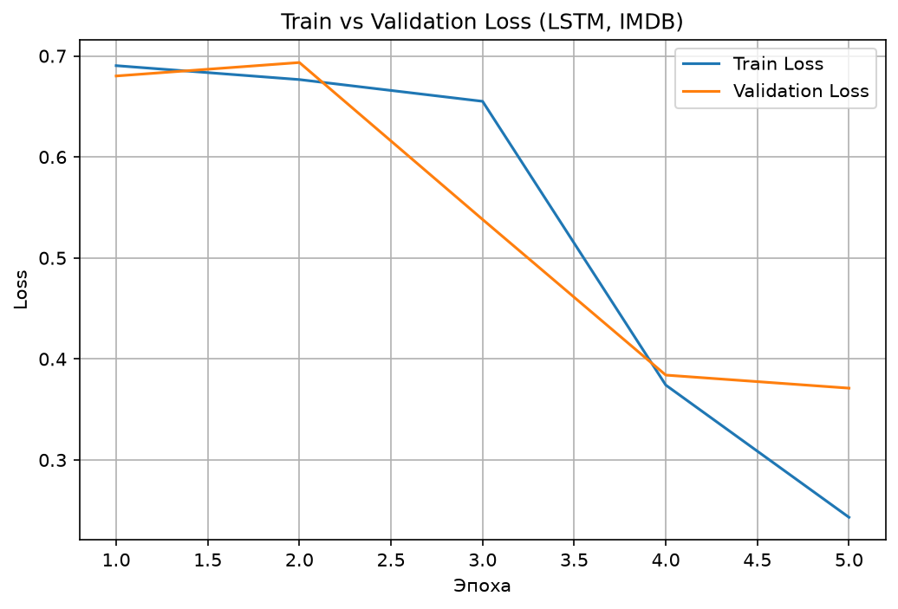

# IMDB Sentiment Analysis with LSTM

Классификация тональности отзывов на фильмы (positive/negative) с помощью LSTM на PyTorch. Текст обрабатывается и словарь строится вручную, без готовых библиотек токенизации.

## Датасет
[IMDB](https://huggingface.co/datasets/stanfordnlp/imdb): 25 000 отзывов train / 25 000 test, сбалансирован по классам (по 12 500 каждого).

## Предобработка текста
- Приведение к нижнему регистру, удаление HTML-тегов и небуквенных символов
- Словарь построен по частоте слов (минимум 5 вхождений), итоговый размер — 28 771 слово
- Последовательности обрезаны/дополнены до длины 200 токенов
- Два служебных токена: `<PAD>` (выравнивание длины) и `<UNK>` (слова вне словаря)

## Архитектура
Embedding(28771 → 100, padding_idx=0)
LSTM(100 → 128, batch_first=True)
Dropout(0.3)
Linear(128 → 1)

Embedding обучается с нуля вместе со всей сетью.

## Обучение
- Optimizer: Adam (lr=0.001)
- Loss: BCEWithLogitsLoss (сигмоида + binary cross-entropy)
- 5 эпох, batch size 32

## Результаты
**Test accuracy: 84.02%**
**Test F1: 83.92%**

| Класс | Precision | Recall | F1 |
|---|---|---|---|
| negative | 0.84 | 0.85 | 0.84 |
| positive | 0.84 | 0.83 | 0.84 |

Precision и recall сбалансированы между классами — модель не смещена в сторону одного из них.



Первые две эпохи loss держится около 0.69 (log(2) — уровень случайного угадывания): модель ещё не нашла полезных признаков, пока embedding-слой обучается с нуля. После 3-й эпохи происходит резкий спуск. К 5-й эпохе появляется небольшой разрыв между train и val loss — начало лёгкого переобучения.

## Анализ ошибок
3994 ошибки из 25 000 (16%). Частый паттерн — отзывы, которые **начинаются с позитивных или одобрительных формулировок**, даже если итоговая оценка негативная (например, "I love sci-fi and am willing to put up with a lot... I tried to like this, I really did, but..."). Похоже, модель придаёт больший вес ранним сигналам в тексте, чем более поздним — это согласуется с тем, что в обычной LSTM (без механизма attention) память о начале последовательности может доминировать над тем, что было прочитано позже, особенно в длинных текстах.

Это прямое практическое наблюдение, которое указывает на потенциальное улучшение: **Bidirectional LSTM** или **attention-механизм** могли бы лучше взвешивать информацию из разных частей отзыва, а не полагаться в основном на начало текста.

## Возможные улучшения
- Предобученные embeddings (GloVe, Word2Vec) вместо обучения с нуля
- Увеличение max_len для более длинного контекста
- Двунаправленный LSTM (Bidirectional) — учитывает контекст в обе стороны
- Fine-tuning предобученного трансформера (BERT/DistilBERT) как следующий шаг

## Запуск
```bash
pip install -r requirements.txt
jupyter notebook imdb_sentiment_lstm.ipynb
```